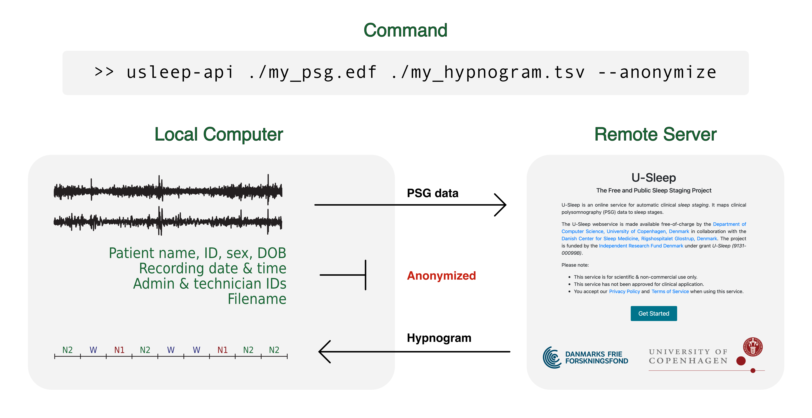

# U-Sleep API Python Bindings
Python bindings to the U-Sleep Webserver API ([https://sleep.ai.ku.dk](https://sleep.ai.ku.dk)).


## Purpose and Usage
The U-Sleep Webserver provides a free and highly accurate sleep staging algorithm for Polysomnography data. It is publicly available for anyone interested in clinical sleep research. For details, see [https://www.nature.com/articles/s41746-021-00440-5](https://www.nature.com/articles/s41746-021-00440-5).

This repository stores Python bindings to the U-Sleep Webserver API. The Python bindings may be used to easily upload PSG files for scoring to the U-Sleep webservice and fetch the results without the need for installing anything except Python and this package (see [Installation](#installation)).

The API bindings may be called from a Python script by importing the `USleepAPI` class (see [Python Example](#python-example) or [Detailed Python Example](#detailed-python-example) below) or by calling the `usleep-api` console script (see [Quick Start](#quick-start)) below.



## Installation
Via PIP:

```bash
pip install usleep-api
```

Alternatively, you may pull and install the latest version from GitHub:

```bash
git clone https://github.com/perslev/U-Sleep-API-Python-Bindings
pip install ./U-Sleep-API-Python-Bindings
```

## API Overview

A brief overview of the API is provided at [https://sleep.ai.ku.dk/docs/api/overview](https://sleep.ai.ku.dk/docs/api/overview).

The API is documented at [https://sleep.ai.ku.dk/docs/api/documentation](https://sleep.ai.ku.dk/docs/api/documentation).

Access to the API must be requested at [https://sleep.ai.ku.dk/docs/api/access](https://sleep.ai.ku.dk/docs/api/access).

## Authentication
Requests to any API endpoint must include an API authentication token. To obtain a token:

1. Log in to your account at [https://sleep.ai.ku.dk/login](https://sleep.ai.ku.dk/login).
2. Select "Account" and "Generate API Token" from the drop-down menu.
3. Paste the API token into your script or create an environment variable to store the token (see details below).

At the time of writing the obtained token is valid for 12 hours. Once expired, a new token must be generated following the above procedure. Keep your token(s) private as they represent your identity to the server and allow others to authenticate on your behalf.

#### API Token Environment Variable
It is recommended to store your API tokens using an environment variable named `USLEEP_API_TOKEN`. For instance, with a token `ABCDEF123456`:

```bash
>> export USLEEP_API_TOKEN=ABCDEF123456
```

Calls may now be made to the U-Sleep API using the console script (see [Quick Start](#quick-start)), the `USleepAPI` Python class (see [Python Example](#python-example)) or directly, e.g. with:

```bash
curl -s -X GET -H "Authorization: Bearer $USLEEP_API_TOKEN" https://sleep.ai.ku.dk/api/v1/info/model_names
>> {"models":["U-Sleep v1.0"]}
```

## Quick Start

When installing the `usleep-api` package via PIP, the console script `usleep-api` is made available. Calling this script will allow to score files without the need to create and run a Python script. For instance:

```bash
>> usleep-api ./my_psg.edf ./hypnogram.tsv --anonymize
```

This will upload an anonymized version of the file `./my_psg.edf` to the U-Sleep webservice, then download the scored hypnogram and save it to `./hypnogram.tsv`. Per default, the script scores the PSG at 1/30 Hz using the `U-Sleep v1.0` model and all (automatically inferred) combinations of valid input channels. However, the script accepts several parameters to configure its use. Call `usleep-api --help` to see a list of available options.

## Python Bindings

The `USleepAPI` class provides bindings for most of the API endpoints.

### Python Example
A PSG file may be anonymized, uploaded, scored and the resulting hypnogram downloaded to a file by calling the 
`USleepAPI.quick_predict` convenience method:

```python
import os
from usleep_api import USleepAPI

# Create an API object with API token stored in environment variable 
api = USleepAPI(api_token=os.environ['USLEEP_API_TOKEN'])

# Predict on anonymized PSG and save hypnogram to file
hypnogram, log = api.quick_predict(
    input_file_path="./psg_001.edf",
    output_file_path="./psg_001_hypnogram.tsv",
    anonymize_before_upload=True
)
```

### Detailed Python Example
For more fine-grained control, you may call the relevant lower-level API bindings e.g. as follows:

```python
import logging
logging.basicConfig(level=logging.INFO)
logger = logging.getLogger("api_example")

from usleep_api import USleepAPI

# Create an API token at https://sleep.ai.ku.dk.
# api_token = "eyJ0eXAiOiJKV1Q..."  # Alternatively, insert token here
api_token = os.environ['USLEEP_API_TOKEN']

# Create an API object and (optionally) a new session.
api = USleepAPI(api_token=api_token)
session = api.new_session(session_name="my_session")

# See a list of valid models and set which model to use
logger.info(f"Available models: {session.get_model_names()}")
session.set_model("U-Sleep v1.0")

# Upload a local file (usually .edf format)
session.upload_file("./my_psg.edf", anonymize_before_upload=True)

# Start the prediction on two channel groups:
#   1: EEG Fpz-Cz + EOG horizontal
#   2: EEG Pz-Oz + EOG horizontal
# Using 30 second windows (note: U-Slep v1.0 uses 128 Hz re-sampled signals)
session.predict(data_per_prediction=128*30,
                channel_groups=[["EEG Fpz-Cz", "EOG horizontal"],
                                ["EEG Pz-Oz", "EOG horizontal"]])

# Wait for the job to finish or stream to the log output
# session.stream_prediction_log()
success = session.wait_for_completion()

if success:
    # Fetch hypnogram
    hyp = session.get_hypnogram()
    logger.info(hyp["hypnogram"])

    # Download hypnogram file
    session.download_hypnogram(out_path="./hypnogram", file_type="tsv")
else:
    logger.error("Prediction failed.")

# Delete session (i.e., uploaded file, prediction and logs)
session.delete_session()
```
